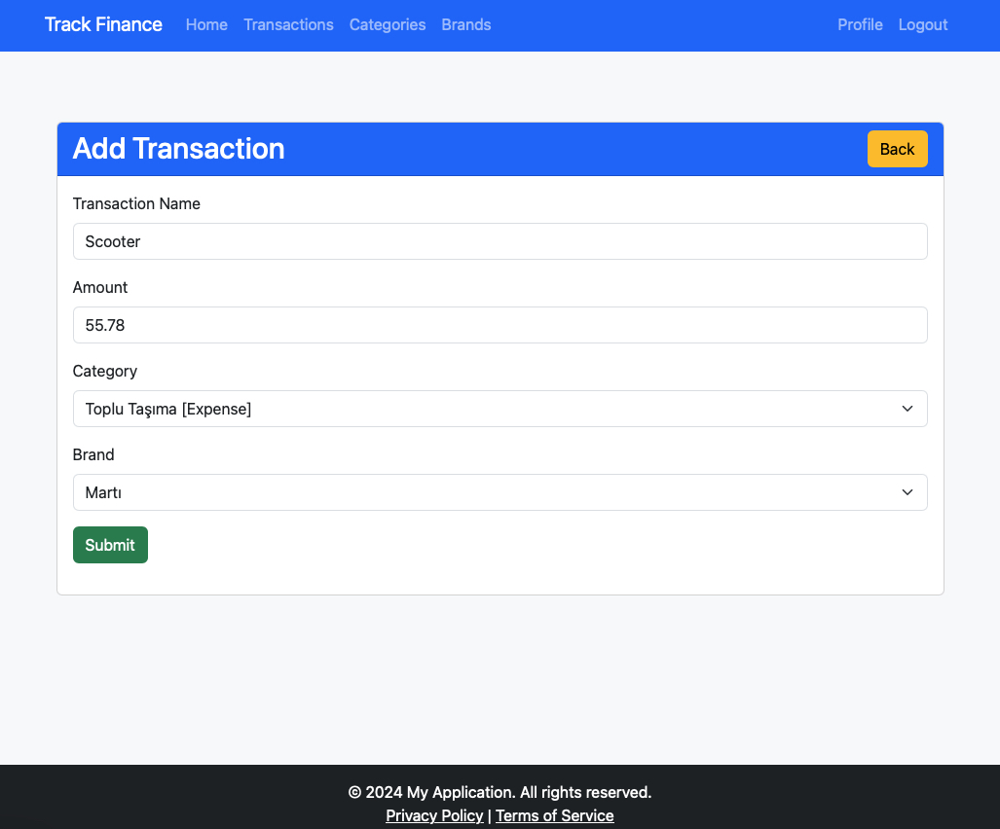

# Track-Finance

A simple finance tracker app using Flask and SQLAlchemy.

### Spoiler 🤫🤐



### Setup

```shell
python3 -m venv env
source env/bin/activate
pip install -r requirements.txt
```

### Run

```shell
flask run
```

### Database

```shell
flask db init

# if deleted migrations folder then delete alembic_version table from database
flask db migrate -m "users table"
flask db upgrade
```
